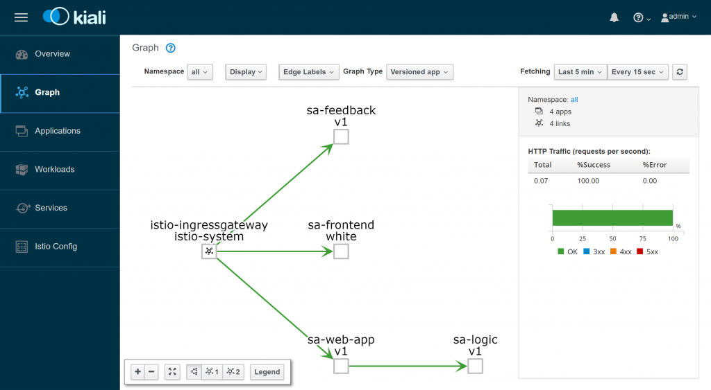
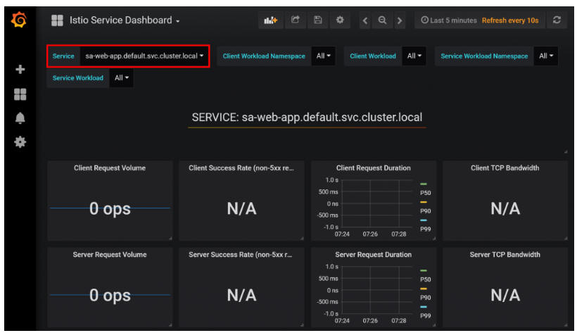
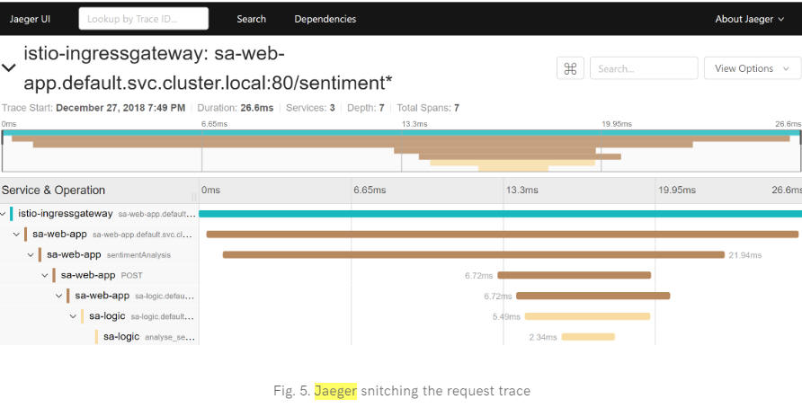

# what is ISTIO 

* Service discovery
* Automatic Load Balance
* Traffic Management, Circuit Break, Retry, Fail-over, Fault Injection
* Policy for Access Controll, Rate Limiting, A/B Testing, Traffic Split
* Metrics, Logs and Trace
* Secure Communication ( mTLS )

#  what is Kiali

an open source project provide the answer to the question: 
* What microservices are part of my Istio service mesh and 
* how are they connected?

* Graph - show topplogy of service calling graph
* Services
* Istion Config - checking the configurations of Istio Components

# Grafana – Metrics Visualization

The metrics collected by Istio are scraped into **Prometheus (database)** and visualized using **Grafana**. 

# what is Jaeger - Distributed Tracing System

**Jaeger** is similar to **Zipkin** but has a different implementation. Supported by the Cloud Native Computing Foundation (CNCF) as an incubating project, Jaeger implements the OpenTracing specification to the last API, and its preferred deployment method is actually Kubernetes.

## Jaeger address following things:

* distributed transaction monitoring
* performance and latency analysis
* root cause analysis
* service dependency analysis

With distributed tracing, we can collect Span s for each network hop, capture them in an overall Trace, and use them to debug issues in our call graph.

