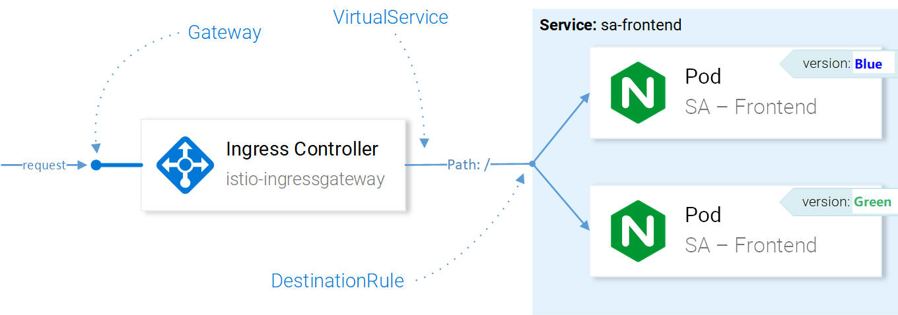
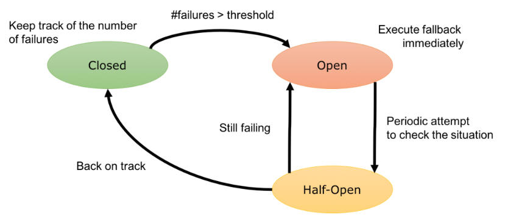
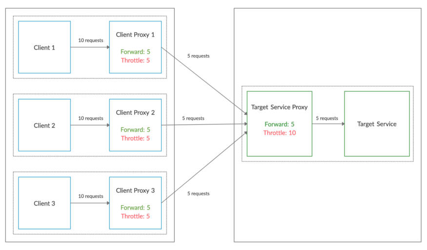

# what is ISTIO

* Service discovery
* Automatic Load Balance
* Traffic Management, Circuit Break, Retry, Fail-over, Fault Injection
* Policy for Access Controll, Rate Limiting, A/B Testing, Traffic Split
* Metrics, Logs and Trace
* Secure Communication ( mTLS )

## Installing Istio

```shell
$ helm template install/kubernetes/helm/istio --name istio \ 
    --set global.mtls.enabled=false \
    --set tracing.enabled=true \ 
    --set kiali.enabled=true \
    --set grafana.enabled=true \
    --namespace istio-system > istio.yaml
```

The above command prints out the core components of Istio into the file istio.yaml. Customized the template using the following parameters:

* **mtls.enabled** is set to false to keep the introduction focused.
* **tracing.enabled** enables tracing of requests using jaeger.
* **kiali.enabled** installs Kiali in our claster for Visualizing Services and Traffic
* **grafana.enabled** installs Grafana to visualize the collected metrics.

## what is Kiali

an open source project provide the answer to the question:

* What microservices are part of my Istio service mesh and 
* how are they connected?


* Graph - show topplogy of service calling graph
* Services
* Istion Config - checking the configurations of Istio Components

## Grafana – Metrics Visualization

The metrics collected by Istio are scraped into **Prometheus (database)** and visualized using **Grafana**. 


## what is Jaeger - Distributed Tracing System

**Jaeger** is similar to **Zipkin** but has a different implementation. Supported by the Cloud Native Computing Foundation (CNCF) as an incubating project, Jaeger implements the OpenTracing specification to the last API, and its preferred deployment method is actually Kubernetes.

### Jaeger address following things

* distributed transaction monitoring
* performance and latency analysis
* root cause analysis
* service dependency analysis


With distributed tracing, we can collect Span s for each network hop, capture them in an overall Trace, and use them to debug issues in our call graph.


## Intro to Ingress Gateway

allowing traffic into your cluster is through Istio’s **Ingress Gateway**, it enables Istio’s features like routing, security, monitoring.

During Istio’s installation, the **Ingress Gateway** component and a service that exposes an **external IP** were installed into the cluster.

```yaml
apiVersion: networking.istio.io/v1alpha3
kind: Gateway
metadata:
  name: http-gateway
spec:
  selector:
    istio: ingressgateway
  servers:
  - port:
      number: 80
      name: http
      protocol: HTTP
    hosts:
    - "*"
```

## VirtualService resource

The VirtualService instructs the Ingress Gateway how to route the requests to destination,

For Example, requests coming through the http-gateway must be routed to the **sa-frontend, sa-web-app and sa-feedback** services.

```yaml
kind: VirtualService
metadata:
  name: sa-external-services
spec:
  hosts:
  - "*"
  gateways:
  - http-gateway                      # 1
  http:
  - match:
    - uri:
        exact: /
    - uri:
        exact: /callback
    - uri:
        prefix: /static
    - uri:
        regex: '^.*\.(ico|png|jpg)$'
    route:
    - destination:
        host: sa-frontend             # 2
        port:
          number: 80
```

## A/B Testing – Destination Rules in Practice

* In simple terms, A/B testing is a way to compare two versions of something to determine which performs better .
* In an A/B test, some percentage of your users automatically receives “version A” and other receives “version B.
* It is a controlled experiment process. To run the experiment user groups are split into 2 groups.

If there is no "**session affinity**", Some files are not found because they are named differently in the different versions of the app. Let’s verify that:

```shell
  $ curl --silent http://$EXTERNAL_IP/ | tr '"' '\n' | grep main
  /static/css/main.c7071b22.css
  /static/js/main.059f8e9c.js

  $ curl --silent http://$EXTERNAL_IP/ | tr '"' '\n' | grep main
  /static/css/main.f87cd8c9.css
  /static/js/main.f7659dbb.js
```

We’ll achieve this using **Consistent Hash Loadbalancing**, which is the process that **forwards requests from the same client to the same backend instance**, using a predefined property, like an HTTP header.



Using Destination Rules we can configure load balancing to have **session affinity** and ensure that the same user is responded by the same instance of the service. This is achievable with the following configuration:

```yaml
apiVersion: networking.istio.io/v1alpha3
kind: DestinationRule
metadata:
  name: sa-frontend
spec:
  host: sa-frontend
  trafficPolicy:
    loadBalancer:
      consistentHash:
        httpHeaderName: version   # 1
```

## Canary Testing

* Canary Testing is a way to reduce risk and validate new software by releasing software to a small percentage of users. With canary testing, you can deliver new features to certain groups of users at a time.
* Since the new feature is only distributed to a small number of users, its impact is relatively small and changes can be reversed quickly should the new code prove to be buggy.
* It is a technique to reduce the risk of introducing a new software version in production by slowly rolling out the change to a small subset of users before rolling it out to the entire infrastructure and making it available to everybody.
* While canary releases are a good way to detect problems and regressions, A/B testing is a way to test a hypothesis using variant implementations.

## Blue / Green Deployments - it is not A/B testing

"Blue-green deployment is a technique that reduces downtime and risk by running two identical production environments called Blue and Green."- cloudfoundry. 

Two environments, both production. One might have version 1.0.0 (green) while blue has 1.0.1.

Many times traffic is slowly increased to blue while watching for errors or undesirable changes in user behavior.

Once all the traffic is moved off from the green (1.0.0) version the environment is shut down. At that point "blue" becomes "green" and the cycle starts over.

## Timeouts and Retries with Istio

```yaml
apiVersion: networking.istio.io/v1alpha3
kind: VirtualService
metadata:
  name: sa-logic
spec:
  hosts:
    - sa-logic
  http:
  - route: 
    - destination: 
        host: sa-logic
        subset: v1
      weight: 50
    - destination: 
        host: sa-logic
        subset: v2
      weight: 50
    timeout: 8s           # 1
    retries:
      attempts: 3         # 2
      perTryTimeout: 3s   # 3
```

1. The request has a timeout of 8 seconds.
2. We attempt 3 times
3. An attempt is marked as failed if it takes longer than 3 seconds.

## CircuitBreakers with Istio



### Hystrix vs Istio

* You can configure and use advanced resiliency features from Istio without changing the application code. Hystrix implementation requires changing each of your services to include the Hystrix libraries.
* when all instances in a load balancing pool have failed, Istio Envoy will return HTTP 503. Application need to **implement any fallback logic** that is needed to handle the HTTP 503 error code from an upstream service. On the other hand, **Hystrix does provide a fallback implementation** which is very helpful. Hystrix fallback can be returning an error message, single default value, from cache or even call another service.
* Envoy is completely transparent to the application. The Hystrix library has to be embedded in each of the service calls.
* Istio can be used as a circuit breaker in a **multi-language** landscape, however, Hystrix is focused primarily on **Java** applications.

```yaml
apiVersion: networking.istio.io/v1alpha3
kind: DestinationRule
metadata:
  name: reviews-cb-policy
spec:
  host: reviews.prod.svc.cluster.local
  trafficPolicy:
    connectionPool:
      tcp:
        maxConnections: 100
      http:
        http2MaxRequests: 1000
        maxRequestsPerConnection: 10
    outlierDetection:
      consecutive5xxErrors: 7
      interval: 5m
      baseEjectionTime: 15m
```

* **Maximum Connections**: The maximum number of connections to a backend (service level). Any excess connection will be **pending in a queue**.
* **Maximum Pending Requests**: The maximum number of pending requests to a backend. Any excess pending requests will be **denied**.
* **Maximum Requests**: The maximum number of requests in a cluster at any given time. You can modify this number by changing the maxRequestsPerConnection field.

> ### http2MaxRequests
>
> Another parameter that we mentioned at the start is http2MaxRequests. Despite the name, this parameter is not HTTP2 specific. It dictates the **number of maximum outstanding requests to the destination service**.
>
> In the case of HTTP1, it’s roughly equivalent to tcp.maxConnections as in HTTP1, there can only be 1 active request on a TCP connection. Although the TCP connections can be reused using tcp.tcpKeepalive and http.maxRequestsPerConnection parameters, the previous request has to complete before the next request can be sent.
>
> For HTTP2, http2MaxRequests is very important since, with HTTP2, we can send multiple concurrent requests on a single TCP connection. So to control the traffic flow, we need to put a limit on max outstanding requests rather than max TCP connections.
>
>> use **tcp.maxConnections with http.http1MaxPendingRequests** or just **http2MaxRequests**, The results will almost be the same (I said almost, because with http2MaxRequests we won’t have to deal with pending requests).
>

### Scenario #3

```yaml
apiVersion: networking.istio.io/v1alpha3
kind: DestinationRule
metadata:
  name: pyserver-service
spec:
  host: pyserver-service
  trafficPolicy:
    connectionPool:
      tcp:
        maxConnections: 5
      http:
        http1MaxPendingRequests: 1
```



The system allows only 5 concurrent requests from all three pods combined.


