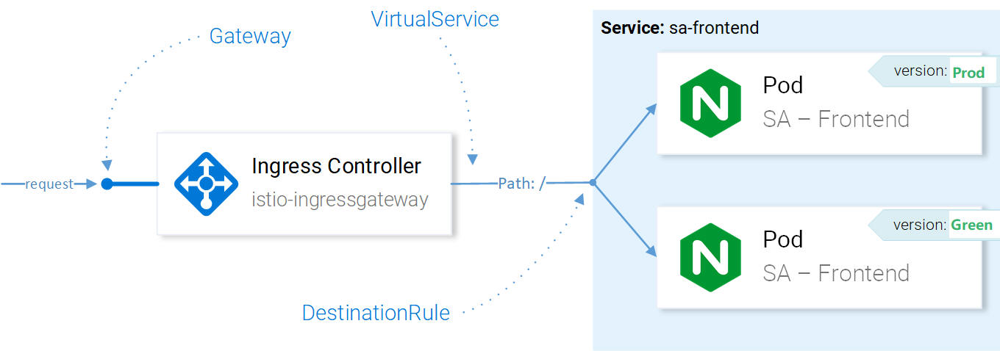

# what is ISTIO

* Service discovery
* Automatic Load Balance
* Traffic Management, Circuit Break, Retry, Fail-over, Fault Injection
* Policy for Access Controll, Rate Limiting, A/B Testing, Traffic Split
* Metrics, Logs and Trace
* Secure Communication ( mTLS )

## Installing Istio

```shell
$ helm template install/kubernetes/helm/istio --name istio \ 
    --set global.mtls.enabled=false \
    --set tracing.enabled=true \ 
    --set kiali.enabled=true \
    --set grafana.enabled=true \
    --namespace istio-system > istio.yaml
```

The above command prints out the core components of Istio into the file istio.yaml. Customized the template using the following parameters:

* **mtls.enabled** is set to false to keep the introduction focused.
* **tracing.enabled** enables tracing of requests using jaeger.
* **kiali.enabled** installs Kiali in our claster for Visualizing Services and Traffic
* **grafana.enabled** installs Grafana to visualize the collected metrics.

## what is Kiali

an open source project provide the answer to the question:

* What microservices are part of my Istio service mesh and 
* how are they connected?


* Graph - show topplogy of service calling graph
* Services
* Istion Config - checking the configurations of Istio Components

## Grafana – Metrics Visualization

The metrics collected by Istio are scraped into **Prometheus (database)** and visualized using **Grafana**. 


## what is Jaeger - Distributed Tracing System

**Jaeger** is similar to **Zipkin** but has a different implementation. Supported by the Cloud Native Computing Foundation (CNCF) as an incubating project, Jaeger implements the OpenTracing specification to the last API, and its preferred deployment method is actually Kubernetes.

### Jaeger address following things

* distributed transaction monitoring
* performance and latency analysis
* root cause analysis
* service dependency analysis


With distributed tracing, we can collect Span s for each network hop, capture them in an overall Trace, and use them to debug issues in our call graph.


## Intro to Ingress Gateway

allowing traffic into your cluster is through Istio’s **Ingress Gateway**, it enables Istio’s features like routing, security, monitoring.

During Istio’s installation, the **Ingress Gateway** component and a service that exposes an **external IP** were installed into the cluster.

```yaml
apiVersion: networking.istio.io/v1alpha3
kind: Gateway
metadata:
  name: http-gateway
spec:
  selector:
    istio: ingressgateway
  servers:
  - port:
      number: 80
      name: http
      protocol: HTTP
    hosts:
    - "*"
```

## VirtualService resource

The VirtualService instructs the Ingress Gateway how to route the requests to destination,

For Example, requests coming through the http-gateway must be routed to the **sa-frontend, sa-web-app and sa-feedback** services.

```yaml
kind: VirtualService
metadata:
  name: sa-external-services
spec:
  hosts:
  - "*"
  gateways:
  - http-gateway                      # 1
  http:
  - match:
    - uri:
        exact: /
    - uri:
        exact: /callback
    - uri:
        prefix: /static
    - uri:
        regex: '^.*\.(ico|png|jpg)$'
    route:
    - destination:
        host: sa-frontend             # 2
        port:
          number: 80
```

## A/B Testing (session affinity) – Destination Rules in Practice

A/B Testing is used when we have two versions of an application (usually those differ visually) that we are not 100% sure which will increase user interaction and so we try both versions at the same time and collect metrics.

We’ll achieve this using **Consistent Hash Loadbalancing**, which is the process that **forwards requests from the same client to the same backend instance**, using a predefined property, like an HTTP header.



Using Destination Rules we can configure load balancing to have **session affinity** and ensure that the same user is responded by the same instance of the service. This is achievable with the following configuration:

```yaml
apiVersion: networking.istio.io/v1alpha3
kind: DestinationRule
metadata:
  name: sa-frontend
spec:
  host: sa-frontend
  trafficPolicy:
    loadBalancer:
      consistentHash:
        httpHeaderName: version   # 1
```
